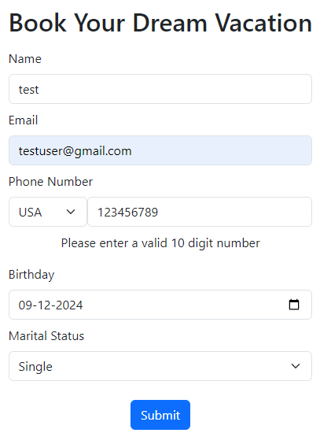
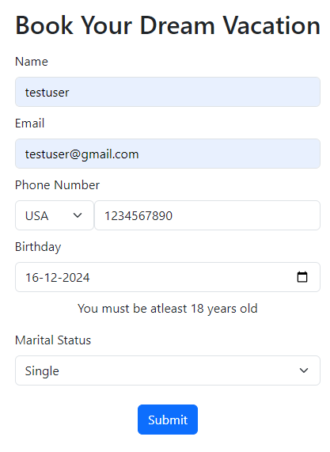

# Destination Paradise

Fictional travel agency. This is a sample practice project from the [code360](https://www.naukri.com/code360/web-development?offering_type=WEB_PROJECTS) website.

## Tools used

- HTML
- CSS (bootstrap)
- Javascript
- Bootstrap version 

## Folders and Files

- images -> folder contains the images being displayed in the carousel.
- Destination_Paradise.pdf -> instructions on what to be included in the project.

## Notes

## Adding Bootstrap

To add bootstrap just check the download section provided on the website for more details. The version that is used in the project is `5.3.3`. We use the cdn way to install the required files.

## Working the Navbar

In order to setup the navbar we start with the basic [navbar example](https://getbootstrap.com/docs/5.3/components/navbar/#supported-content) provided in the documentations of the bootstrap. After modifying the same to add only the required links and input field we get the following refined `nav` tag and this is the subsequent result.

Next we try to center the provided links `Home`, `About` and `Destinations`. First after observation the provided elements `ul` containing the links and `form` are child of parent `div` tag. So we use the `row` class on parent `div` tag and `col` on both child tags to create 2 equal columms. 

We have an expanded `search` input field and in order to reduce its size we use the `col-sm-*` class.

And to center the links for the `ul` tag we use the `justify-content-center` class.

The Destinations url needs to display options on hover and in order to do this we need to add a bit of custom css.

## Carousel

In order to display the slides of carosuel we need images. As there are no images being provided in the instructions specified we need to get 5 such images ourselves. This are stored in the `images` folder.  Next looking at the template code provided, we already have the `previous` and `next` buttons added to slide through the `carousel`. First we add the images downloaded. Each carousel image is added with following classes

`img-fluid` -> makes the images responsive.
`rounded-5` -> adds border-radius to the images.
`d-block` -> makes the images visible on all sizes of screen.
`w-100` -> not exactly sure on this but maybe it sets the element to occupy 100% of the width of parent tag width.

The buttons provided for moving across slides do not work and for this we need to add the indicators in the carousel slides to do that. These are `carousel indicators` which represent the images in the carousel and enable the sliding actions. The [basic example](https://getbootstrap.com/docs/5.3/components/carousel/#basic-examples) provided in the bootstrap doc was copied and modified to accordingly for the images.

A basic carousel is ready. Now in order to make the slides move automatically we add the `data-bs-ride=carousel` attribute to the main parent tag and in each of the slide component we specify the `data-bs-interval=3000` where 3000 are in milliseconds to switch to the next image in the slide.

## Home Div settings

We set the 2 sections in the `home` side by side using the flex styling first. We also add border on the left side of `home-form-section` class div in order to differentiate between them.

## Booking form

The form to be added requires the `name`, `email`, `birthday`, `marital status` fields. This are pretty straightforward to add. Here we customize the `phone number` field so that the `countryCode` dropdown and input field to enter numbers appear side to side.

To do this we add the `countryCode` select tag and number input field in a single div and add `d-flex` and `flex-row` classes on it. This will add flex styling with both components being displayed in the same row.

The `countryCode` to be displayed is provided in a javascript object in the instructions and we need to load them in the `select` tag using javascript.

Finally a button to submit the form details is added after the form. To center this we add `d-flex` and `flex-column` on the parent tag for the `form` element and set `align-self-center` class on the button element. The button must be inside the `form` tag to actually submit the data to the required `action` parameter specified function or url which was missed by me and fixed it.

### Validations

In the given instructions for booking form section, it's mentioned that each input field is compulsory to be provided with data. In order to solve this just add the `required` parameter to the input tags. Next we move to the validation for phone numbers. The instructions also mention in case of error we must provide a error response below the input field as indication to the user so we add a `span` tag and provide it with id. Initially during the data entering phase of user this tag should be hidden and only displayed when an error is generated. Hence we add the appropriate display css to this tag by using css id selector. The logic in javascript uses regular expression in order to validate the length and number check for the phone number. The validation of birthdate is much trickier part. This required approximate calculation of years from the provided birthdate. Both the functions are added in the `onchange` attribute so that after the provided input field is populated the validation checks can be triggered. Finally the button calls the final validation function which will generate the consolidation message as per instructions in case all validations are passsing and we mimic the action of resetting form.

Phone number validation fails

Birthday validation fails

All validations passing on form submission

The successful validation post alert pop up should result into a clearing of the input data and so we use the `reset` function on the form DOM object for this purpose.

## Packages Section

The working of packages section involves the dynamic loading of packages entries from the `packages` array mentioned in the script.js. A new function `loadPackages` is loading this packages one by one. Related to styling the css can only be understood once going through.

## About Us Section

This is achieved by setting a `h2` tag with content as `About Us` and `div` tag with 2 children `div` tags in it. The first child `div` tag contains the  `img` tag and second `div` tag contains the description as per the demo ui shown being mirrored as mentioned in the instructions. To center text we can use the `text-center` class. Other code is easy to understand on reading so not going to go deep into it. 

## Search Field 

In order to make the search field working a new `eventListener` is added on the input field which loops across the packages and checks if the name of the package is matching with entered value and loads only that particular package and skips the other. In case of input being empty we call the `loadPackages` function to display all the packages again.